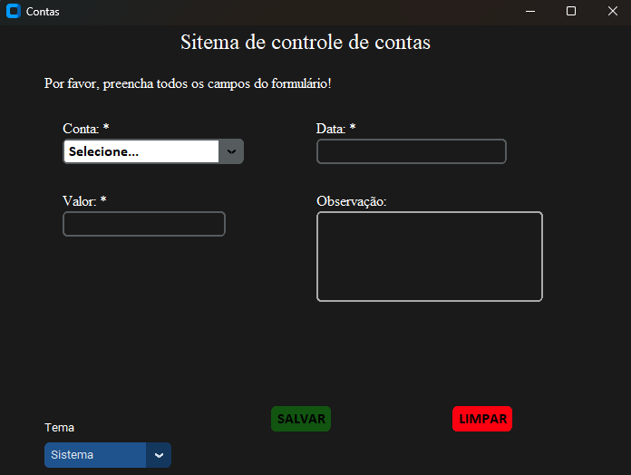

<h1 align="center"> Sistema de controles de contas </h1>

Esse é um sistema programado em Python para auxiliar as pessoas a controlar as suas contas já pagas.

  <a href="#-tecnologias">Tecnologias</a>&nbsp;&nbsp;&nbsp;|&nbsp;&nbsp;&nbsp;
  <a href="#-projeto">Projeto</a>&nbsp;&nbsp;&nbsp;|&nbsp;&nbsp;&nbsp;
  <a href="#-layout">Layout</a>&nbsp;&nbsp;&nbsp;|&nbsp;&nbsp;&nbsp;

 

## 🚀 Tecnologias  

Este projeto foi desenvolvido com a seguinte linguagem:

- Python

## 💻 Projeto

Após ter pago a conta, o usuário pode abrir o <b>Sistema de Controle de Contas</b>, passar as informações que ele pede e salva-las. Caso tenha curiosidade em visualizar as contas pagas, o usuário pode abrir o excel que o sistema cria para ver as informações passadas. Nesse excel estará todas os dados que ele informou, sendo eles:
- Conta = Nome da conta paga;
- Valor = Valor da conta paga;
- Data = Data que fez o pagamento;
- Observação = Qualquer informação adicional.

## 🔖 Layout

  

